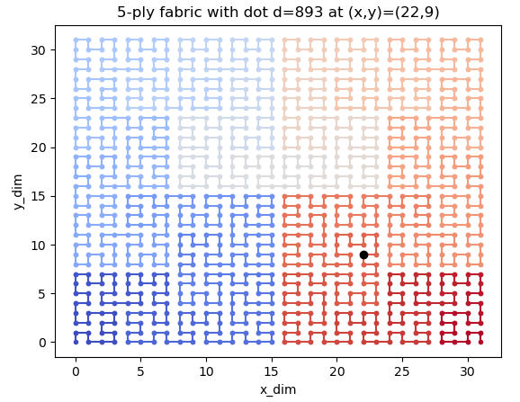
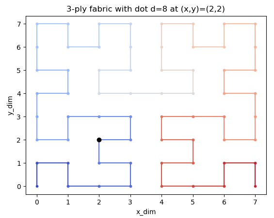
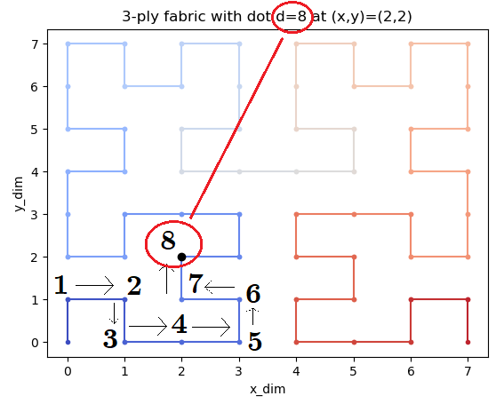
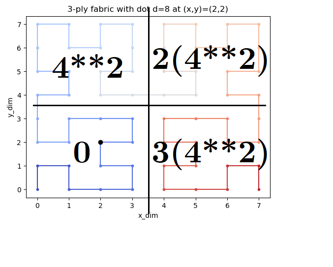
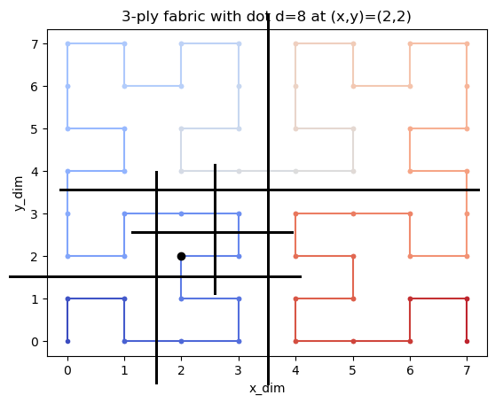
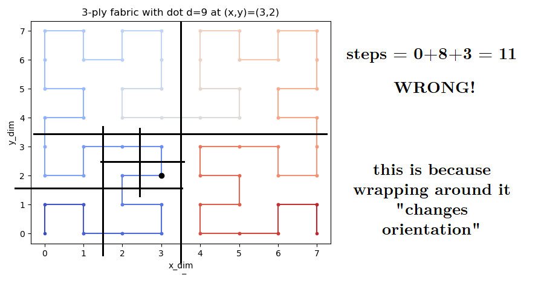
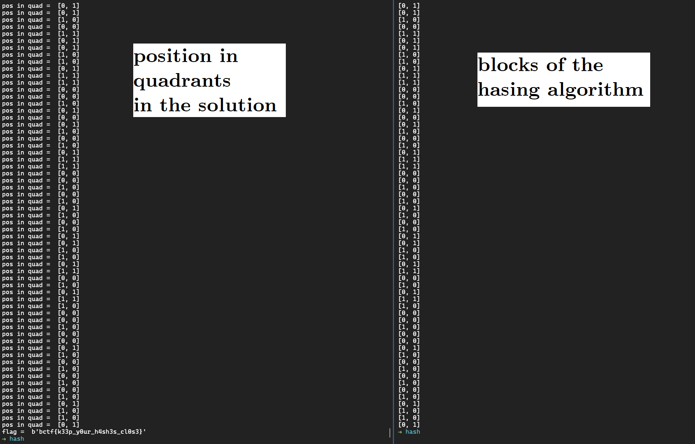

## yarn hashing (misc, 354 points, 21 solves)


>Maybe if I weave the flag into a tight enough space, you won't be able to find it... Flag format: bctf{...}

Had a lot of fun with this challenge! I solved it just 2 minutes before the end of the CTF!

## Overview

The challenge consists of an algorithm which, given a string (the flag in this case), after converting it into an integer, hashes it giving 2 new numbers `(x, y)`. This hashing algorithm has a parameter `ply` that specifies the cycles of the algorithm.

For example: a `5-ply` algorithm on the number `10000` gives as output: `(16, 24)`.

We have `(x, y)` calculated from the flag and we need to find the number.

## "Unwrapping" the algorithm
Let's look at the code. 👀

Some variables are defined at the beginning:

```python
self.n_dims  = 2
self.n_winds = 1 << (self.n_dims * ply) # equal to 4**ply
```

The function that hashes is `fold()`:

```python
 def fold(self, dot):
        x = 0
        y = 0
        take_up = dot
        skein = 1
        while skein < (1 << (self.ply)):
            block_x = 1 & (take_up // 2)
            block_y = 1 & (take_up ^ block_x)
            x, y = self.twist(x, y, block_x, block_y, skein)
            x += skein * block_x
            y += skein * block_y
            take_up = take_up // 4
            skein *= 2
        return (x, y)
```
It cycles `while skein < ply**2`, and skein is multiplied by 2 at each cycle, so it cycles ply-times (as said before).

At each cycle two "blocks" are calculated. The first checks the parity of the input number divided by two, and the second checks the parity of the input number xor-ed with the first.

At this point a `twist()` function is applied on x and y, and then based on the `block_x` and `block_y` the skein is summed to `x` and `y`. Remember the skein is just the power-of-two to the current cycle. Then the number is divided by four and the cycle continues.

Let's see what the `twist()` function does:
```python
 def twist(self, x, y, block_x, block_y, n_twists):
        if block_y == 0:
            if block_x == 1:
                x, y = self.flip(x, y, n_twists)

            cross = x
            x = y
            criss = cross
            y = criss
        return (x, y)

    def flip(self, x, y, n_twists):
        return ((n_twists-1) - x, (n_twists-1) - y)
```

It "twistes" `x` and `y` if `block_y` is 0. But if `block_x` is 0, it also "flips" `x` and `y`.
Fliping is just calculating the "distance" from the `n_twists` number - minus one. For example

With:
`
n_twists = 64,
x        = 17,
y        = 31 
`
the `flip` functions returns `(46,32)`


## The power of plotting

The challenge also gives us a plotting function... Let's use it (with a small `ply` as you will see).



Hummm... that's strange... Did you notice? The input number is `893` and the `(x,y)` is `(22,8)`.... Let's see a smaller one...



Have you noticed now? Let me show you...



It's the number of steps in this "fractal maze"! You can check it yourself! The "hashing" function `fold()` just takes the number of steps and walks the fractal to calculate the `(x, y)` position. Now we just need to calculate the number of steps given the position in the Fractal Maze.

Btw the Fractal Maze is a 2-D Hilbert Curve (https://wikipedia.org/wiki/Hilbert_curve)

How can we count the number of steps?


## Divide and Conquer

The fractal is simmetrical in the up-down left-right. So it can be divided into 4 equal parts:



In each part the step walked are at least the steps in the part before as described in the image.

So we can divide the fractal, locating the point each time and adding steps based on the position in the 4 parts.

Each of the blocks counts `n**2` steps, with `n` equal to max_x/2 or (max_y/2).



In the example before: `0+2(2**2)+0 = 8`.

It works!

Except... It doesn't.

We are not considering the conditions were the path wraps around and changes orientation. For example if we move just one step to `d = 9`:



We need to take this "wrapping" into account... 

Humm...

Idea! Let's use the `twist()` and `flip()` functions from before!

Ok let's go straight to the solution:

## Solution:

```python
#!/usr/bin/env python3

from Crypto.Util.number import long_to_bytes

ply=112
x=1892567312134508094174010761791081
y=4312970593268252669517093149707062

pos_in_quad=[0,0]
path=0

max_dim=2**ply
max_path=4**ply
n_twist=0

while ply>0:

    # let's check in which quadrants our number is
    # the quadrant position is: pos_in_quad [0/1, 0/1]

    if(x<((max_dim-1)/2) ):
        pos_in_quad[0]=0
    else:
        pos_in_quad[0]=1
        x=x-max_dim//2

    if(y<((max_dim-1)/2)):
        pos_in_quad[1]=0
    else:
        pos_in_quad[1]=1
        y=y-max_dim//2

    print("pos in quad = ", pos_in_quad)

    # let's sum based on the position in the quadrants
    # taking into account flips and twists

    if(pos_in_quad[0]==0 and pos_in_quad[1]==0): # we need a twist
        
        # twist
        cross = x
        x = y
        y = cross

    elif(pos_in_quad[0]==0 and pos_in_quad[1]==1):
        path += max_path//4

    elif(pos_in_quad[0]==1 and pos_in_quad[1]==1):
        path += 2*max_path//4

    elif(pos_in_quad[0]==1 and pos_in_quad[1]==0): # we need a twist and a flip
        path += 3*max_path//4

        # twist
        y=max_dim//2-y-1
        x=max_dim//2-x-1
        # flip
        cross = x
        x = y
        y = cross

    ply-=1
    max_dim=max_dim//2
    max_path=max_path//4

print("flag = ", long_to_bytes(path))
```
Let's run it:

`
flag =  b'bctf{k33p_y0ur_h4sh3s_cl0s3}'`

It works! But let's see more in depth....

Let's plot the `(x,y)` in 4 quadrants at each steps of our solution and the `[block_x, block_y]` of the hashing algorithm:




They are the same! We found a geometrical meaning to the blocks!
